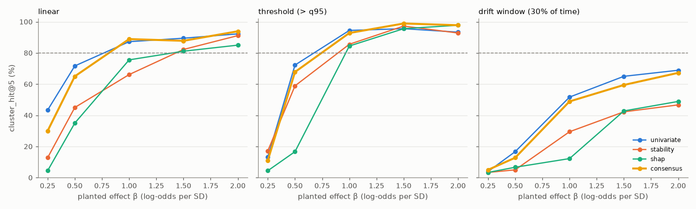
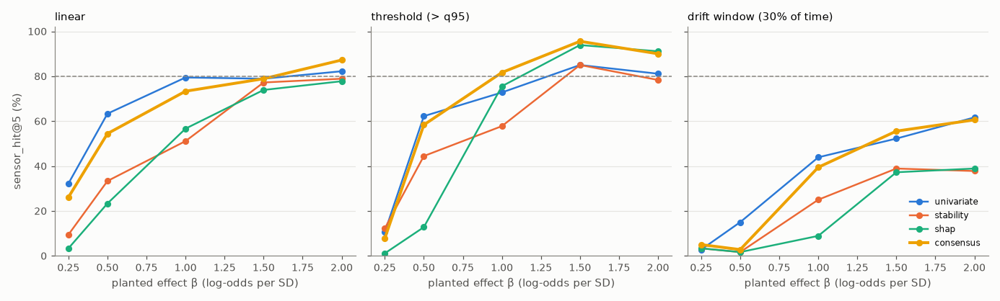
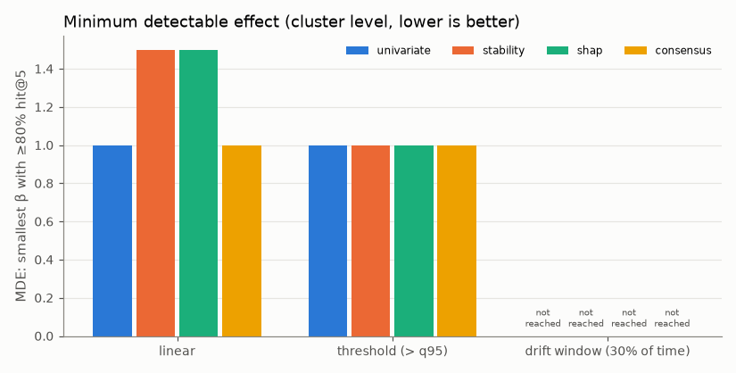
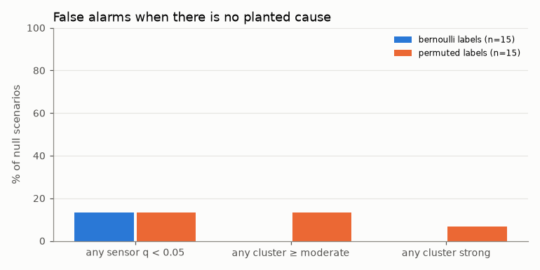
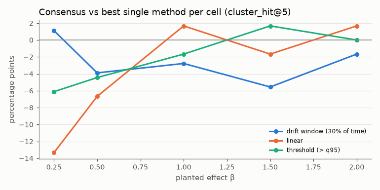

# Planted-fault benchmark

_Generated by `processlens benchmark` from `reports/metrics/benchmark.json`. Do not edit by hand._

**Design.** The real SECOM sensor matrix (all runs, usable sensors, real missingness and correlation) is kept; labels are replaced by synthetic labels generated from known planted causes. The root-cause engine is run unchanged and scored on whether it recovers them. The base rate is held at 6.6% by calibrating the intercept.

- 450 planted scenarios + 30 null scenarios (480 total)
- mechanisms: linear `logit = b0 + β·Σz(x)`; threshold `logit = b0 + β·z(1[x > q95])`; drift window (linear effect inside one contiguous 30% stretch of time)
- β in log-odds per standard deviation of the driver; 1–3 causes from distinct clusters
- hit@k = share of planted causes found in the top k (sensor level: the exact sensor; cluster level: its correlated cluster)

## Recovery by method (averaged over all planted scenarios)

| method | sensor_hit@1 | cluster_hit@1 | sensor_hit@3 | cluster_hit@3 | sensor_hit@5 | cluster_hit@5 |
|---|---|---|---|---|---|---|
| univariate | 0.29 | 0.39 | 0.46 | 0.59 | 0.55 | 0.64 |
| stability | 0.22 | 0.24 | 0.37 | 0.44 | 0.42 | 0.52 |
| shap | 0.20 | 0.25 | 0.34 | 0.41 | 0.40 | 0.46 |
| consensus | 0.29 | 0.35 | 0.46 | 0.56 | 0.54 | 0.62 |

## Recovery vs effect size (ablation)

Cluster level:

Sensor level (exact planted sensor):

## Minimum detectable effect (cluster_hit@5 ≥ 80%)

| method | linear | threshold | drift_window |
|---|---|---|---|
| univariate | 1 | 1 | not reached |
| stability | 1.5 | 1 | not reached |
| shap | 1.5 | 1 | not reached |
| consensus | 1 | 1 | not reached |

## False alarms on null scenarios

30 scenarios with no planted cause. Any sensor with q < 0.05: 13%; any cluster graded moderate or strong: 7%; any cluster graded strong: 3%.

## Consensus vs best single method

Positive = consensus beats the best single method for that cell (chosen in hindsight, so this is a demanding comparison).

## Quality gate

Consensus cluster hit@5 at β ≥ 2: 0.86 (required ≥ 0.8); null strong-evidence rate 0.03 (allowed ≤ 0.2). **PASSED**.

## Runtime

Mean 30.6 s per full analysis (p95 53.7 s), measured while scenarios run in parallel on all cores.

## What this means

- **Linear faults:** the consensus ranks the planted cluster in the top 5 in ≥ 80% of scenarios once the effect is at least **β = 1** log-odds per SD (94% at β = 2). Smaller effects are missed more often.
- **Threshold (> q95) faults:** the consensus ranks the planted cluster in the top 5 in ≥ 80% of scenarios once the effect is at least **β = 1** log-odds per SD (98% at β = 2). Smaller effects are missed more often.
- **Drift window (30% of time) faults:** never reaches 80% top-5 recovery on this grid; even at β = 2 it finds the planted cluster in only 67% of scenarios.
- **Correlated sensors cannot be separated.** At β ≥ 1 the consensus puts the planted *cluster* first in 48% of scenarios but the exact planted *sensor* first in 41%. Treat every member of a suspect cluster as equally suspect.
- **Several simultaneous causes dilute each other.** Averaged over the grid, top-5 recovery is 69% with one planted cause and 52% per cause with three.
- **False alarms with no real cause** (30 null scenarios): at least one sensor passes q < 0.05 in 13%, a cluster is graded moderate or strong in 7%, and graded strong in 3%. A ranking always has a #1; only the evidence grade says whether it means anything.
- **Missing data in the cause sensor** (consensus top-5 recovery at β ≥ 1): drift window (30% of time): 0% missing → 67% (n=3), 0–5% missing → 58% (n=79), >5% missing → 60% (n=8); linear: 0% missing → 100% (n=5), 0–5% missing → 90% (n=79), >5% missing → 89% (n=6); threshold (> q95): 0% missing → 100% (n=2), 0–5% missing → 96% (n=78), >5% missing → 97% (n=10).
- **Consensus vs single methods.** Averaged over all planted scenarios, consensus top-5 recovery is 62% vs 64% for the best single method (univariate). See the ablation figure per mechanism.
- **Benchmark realism.** Planted faults are additive effects on the log-odds of one to three real sensors. Real defects may involve interactions, lags, sensors that were never measured, or label noise, so these numbers are an upper bound for comparable effect sizes, not a guarantee.
