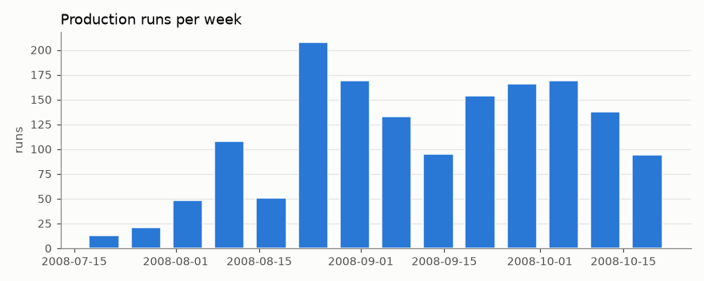
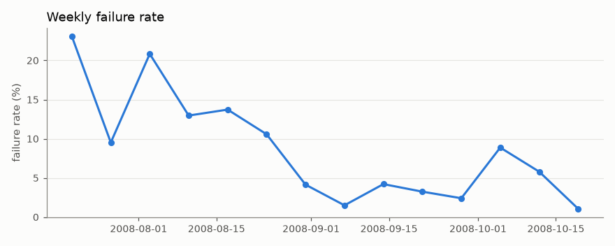
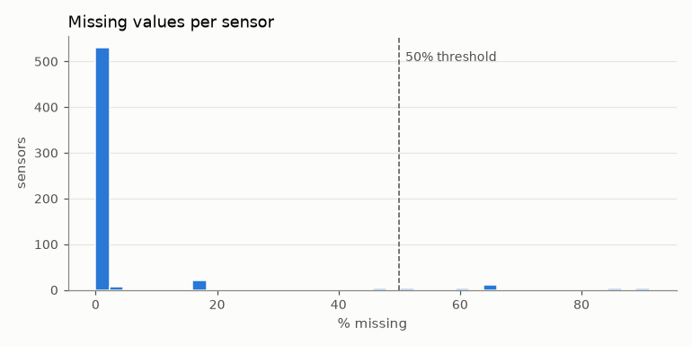
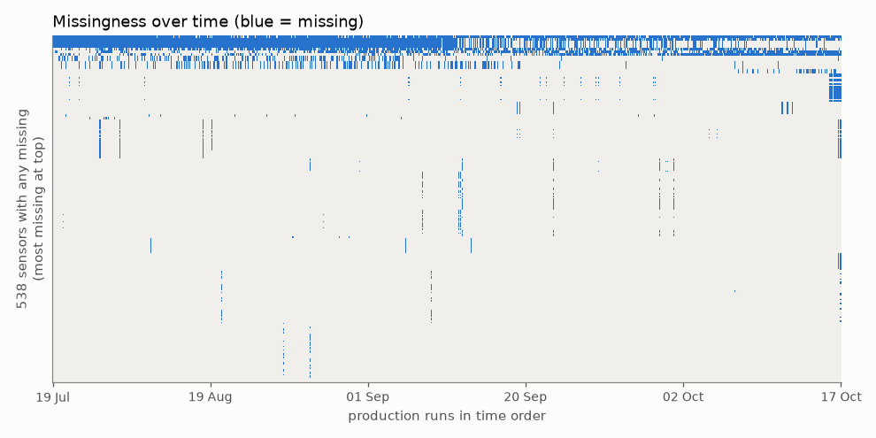
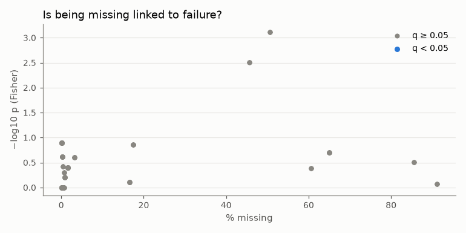
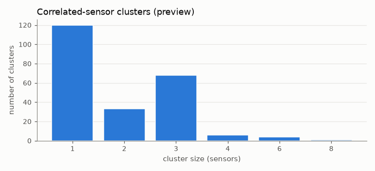

# SECOM data audit

_Generated by `processlens audit`. Every number below is computed from `data/processed/secom.parquet`; do not edit by hand._

The audit describes the full table. Cleaning decisions it motivates are recomputed on the training window only in Phase 2, so the audit itself causes no leakage.

## 1. Shape and label

- Rows (production runs): **1567**; sensors: **590**
- Failures: **104**, passes: **1463**, base rate **6.64%**

## 2. Time coverage

- From **2008-07-19** to **2008-10-17** (90 days, 14 weekly buckets)
- Runs per week: 13–208; weekly failure rate: 1.1%–23.1%
- Failure rate in time-ordered segments matching the 60/20/20 split: 8.1% (940 runs), 3.5% (314 runs), 5.4% (313 runs)

## 3. Missing data

- 4.54% of all sensor cells are missing
- 538 sensors have at least one missing value; 52 are complete
- 1567 of 1567 runs have at least one missing sensor
- 28 sensors are more than 50% missing: `sensor_073`, `sensor_074`, `sensor_086`, `sensor_110`, `sensor_111`, `sensor_112`, `sensor_158`, `sensor_159`, `sensor_221`, `sensor_245`, `sensor_246`, `sensor_247`, `sensor_293`, `sensor_294`, `sensor_346`, `sensor_347`, `sensor_359`, `sensor_383`, `sensor_384`, `sensor_385`, `sensor_493`, `sensor_517`, `sensor_518`, `sensor_519`, `sensor_579`, `sensor_580`, `sensor_581`, `sensor_582`

## 4. Informative missingness

For each of the 538 sensors with some (but not all) values missing, Fisher's exact test checks whether *being missing* is associated with failure. Benjamini–Hochberg FDR at 0.05. **0 sensors** pass.

_No sensor passes the FDR threshold._

Top 10 by p-value (for context, regardless of significance):

| sensor | % missing | fail rate if missing | fail rate if observed | odds ratio | q |
|---|---|---|---|---|---|
| `sensor_073` | 50.7% | 4.5% | 8.8% | 0.49 | 0.102 |
| `sensor_074` | 50.7% | 4.5% | 8.8% | 0.49 | 0.102 |
| `sensor_347` | 50.7% | 4.5% | 8.8% | 0.49 | 0.102 |
| `sensor_346` | 50.7% | 4.5% | 8.8% | 0.49 | 0.102 |
| `sensor_113` | 45.6% | 4.6% | 8.3% | 0.53 | 0.209 |
| `sensor_386` | 45.6% | 4.6% | 8.3% | 0.53 | 0.209 |
| `sensor_520` | 45.6% | 4.6% | 8.3% | 0.53 | 0.209 |
| `sensor_248` | 45.6% | 4.6% | 8.3% | 0.53 | 0.209 |
| `sensor_032` | 0.1% | 50.0% | 6.6% | 14.19 | 1 |
| `sensor_031` | 0.1% | 50.0% | 6.6% | 14.19 | 1 |

## 5. Constant, near-constant and duplicate sensors

- Constant (≤ 1 distinct observed value): **116**: `sensor_006`, `sensor_014`, `sensor_043`, `sensor_050`, `sensor_053`, `sensor_070`, `sensor_098`, `sensor_142`, `sensor_150`, `sensor_179`, `sensor_180`, `sensor_187`, `sensor_190`, `sensor_191`, `sensor_192`, `sensor_193`, `sensor_194`, `sensor_195`, `sensor_227`, `sensor_230`, `sensor_231`, `sensor_232`, `sensor_233`, `sensor_234`, `sensor_235`, `sensor_236`, `sensor_237`, `sensor_238`, `sensor_241`, `sensor_242` … (+86 more)
- Near-constant (one value ≥ 99% of observations, or very few distinct values): **8**: `sensor_075`, `sensor_096`, `sensor_207`, `sensor_210`, `sensor_343`, `sensor_348`, `sensor_479`, `sensor_522`
- Exact-duplicate groups (excluding constants): **0**: _none_

## 6. Correlation structure

Computed on the 446 usable sensors (non-constant, ≤ 50% missing), using rank correlation with pairwise-complete observations.

- 0.30% of 99,211 sensor pairs have |Spearman| > 0.90
- Average-linkage clustering on 1 − |ρ|, cut at |ρ| ≥ 0.8: **232 clusters**, 120 singletons, largest has 8 sensors

## 7. Outliers

Robust z-score (median / 1.4826·MAD) beyond |z| > 5: 348 of 446 usable sensors have at least one flag, 12,466 flags in total. Most flagged:

- `sensor_543`: 661
- `sensor_544`: 573
- `sensor_546`: 554
- `sensor_028`: 398
- `sensor_026`: 388
- `sensor_032`: 354
- `sensor_041`: 239
- `sensor_298`: 211
- `sensor_313`: 193
- `sensor_117`: 192

## 8. Audit conclusions (drive Phase 2)

1. **Drop sensors with more than 50% missing** (28 sensors on the full table). Too little data to impute reliably. In Phase 2 the list is recomputed on the training window only.
2. **Drop constant sensors** (116). They carry no information. Phase 2 re-detects zero variance on train only.
3. **Keep near-constant sensors** (8). A rare value can be exactly what marks a failure; regularisation and trees handle them.
4. **Keep exact duplicates in the model, collapse them in root-cause** (0 duplicate groups). They are harmless for regularised and tree models; the root-cause engine reports clusters, so duplicates merge there.
5. **Add missing-value indicators anyway** (`add_indicator=True`). No sensor passes BH q < 0.05, but indicators are cheap and let the model use any weaker missingness signal.
6. **Median imputation, fit on train only.** 1567 of 1567 runs have at least one missing sensor, so complete-case analysis is not an option; the median is robust to the heavy tails seen in the outlier counts.
7. **Report suspects per correlated cluster, not per sensor.** 0.30% of sensor pairs have |Spearman| > 0.90, and at |ρ| ≥ 0.8 the 446 usable sensors form 232 clusters (largest: 8).
8. **No outlier clipping.** 348 of 446 usable sensors have points beyond robust |z| > 5. Extreme values may be the defect signal; use `RobustScaler` for the linear models; tree models are insensitive to scale.
9. **Time-ordered split.** Weekly failure rate ranges from 1.1% to 23.1% and runs per week from 13 to 208. The process is not stationary, so a random split would leak future conditions into training.
10. **Expect base-rate shift across the split.** Failure rate in the time-ordered train / validation / test segments is 8.1% / 3.5% / 5.4%. Probabilities calibrated on train will be off on later data, so Phase 2 calibrates on validation and reports PR-AUC against each segment's own base rate.
