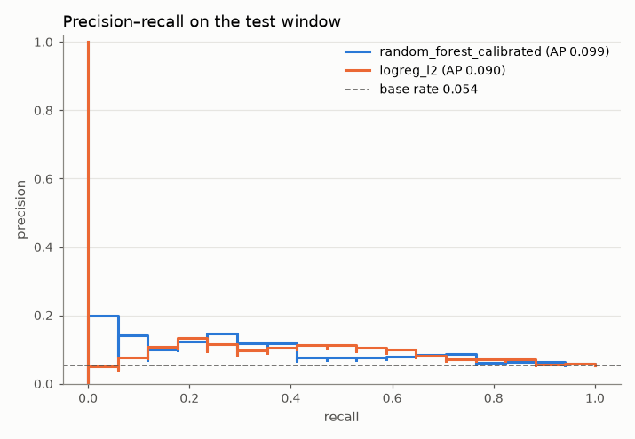
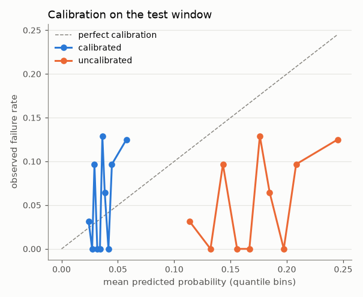
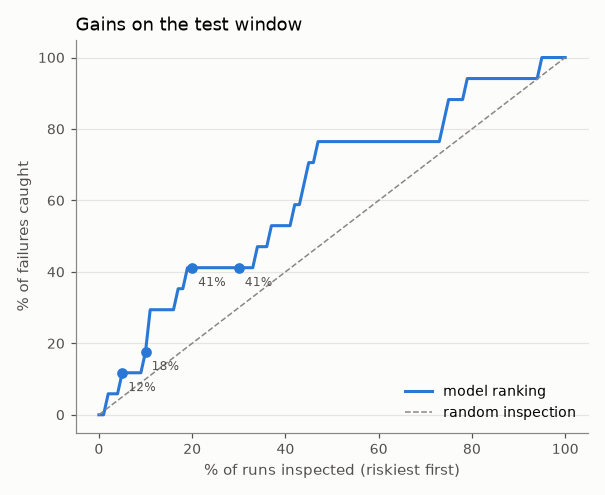
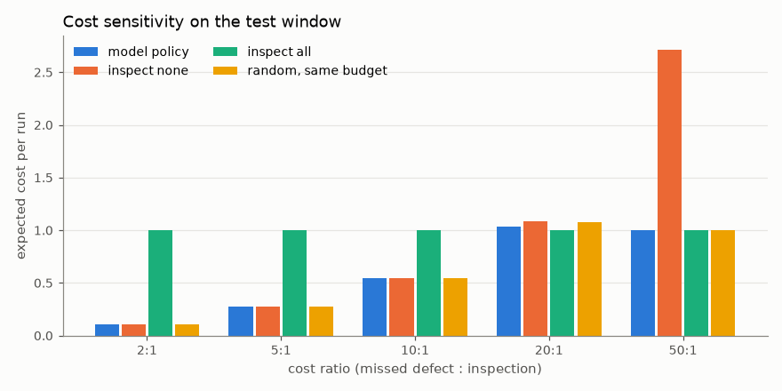

# Defect prediction: model report

_Generated by `processlens train` from `reports/metrics/model.json`. Do not edit by hand._

Git SHA `5821f7c050`, data SHA-256 `54e390261b27`.

## Protocol

1. time-ordered 60/20/20 split;
2. per model: rolling-origin CV PR-AUC inside train, plus metrics on validation (reported);
3. select the best non-dummy model by mean rolling-origin CV PR-AUC (validation holds
   too few failures to rank models reliably);
4. calibrate it on validation;
5. one final pass over test for the selected model, the reference model and the dummy.

## Time-ordered split

| window | dates | runs | failures | failure rate |
|---|---|---|---|---|
| train | 2008-07-19 → 2008-09-20 | 940 | 76 | 8.1% |
| val | 2008-09-20 → 2008-10-02 | 314 | 11 | 3.5% |
| test | 2008-10-02 → 2008-10-17 | 313 | 17 | 5.4% |

## Model selection (train CV and validation; test untouched)

| model | CV PR-AUC per fold | CV mean | val PR-AUC [95% CI] | val base rate | features |
|---|---|---|---|---|---|
| dummy | 0.050, 0.043, 0.021, 0.050 | 0.041 | 0.035 [0.016, 0.057] | 0.035 | 728 |
| logreg_l2 | 0.078, 0.135, 0.016, 0.118 | 0.087 | 0.044 [0.017, 0.152] | 0.035 | 728 |
| logreg_l1 | 0.060, 0.139, 0.015, 0.128 | 0.086 | 0.046 [0.021, 0.123] | 0.035 | 728 |
| random_forest **(selected)** | 0.181, 0.053, 0.033, 0.433 | 0.175 | 0.047 [0.024, 0.096] | 0.035 | 728 |
| lightgbm | 0.071, 0.045, 0.021, 0.097 | 0.059 | 0.034 [0.016, 0.060] | 0.035 | 728 |

## Test window (evaluated once)

Point estimate with 95% bootstrap CI. Compare PR-AUC with the test base rate; a no-skill model scores the base rate.

| model | base rate | PR-AUC | ROC-AUC | Recall @ precision ≥ min | Brier | ECE |
|---|---|---|---|---|---|---|
| random_forest_calibrated | 0.054 | 0.099 [0.049, 0.222] | 0.632 [0.493, 0.764] | 0.059 [0.000, 0.571] | 0.051 [0.028, 0.075] | 0.018 [0.001, 0.045] |
| random_forest_uncalibrated | 0.054 | 0.099 [0.049, 0.222] | 0.632 [0.493, 0.764] | 0.059 [0.000, 0.571] | 0.065 [0.049, 0.083] | 0.118 [0.091, 0.143] |
| logreg_l2 | 0.054 | 0.090 [0.047, 0.165] | 0.645 [0.506, 0.774] | 0.000 [0.000, 0.529] | 0.089 [0.060, 0.118] | 0.086 [0.057, 0.119] |
| dummy | 0.054 | 0.054 [0.029, 0.080] | 0.500 [0.500, 0.500] | 0.000 [0.000, 0.000] | 0.052 [0.031, 0.073] | 0.027 [0.004, 0.052] |

**Paired bootstrap, PR-AUC random_forest − logreg_l2:** +0.009 [-0.060, +0.125]; share of resamples where it is not better: 0.39. Here the CI includes 0, so **we cannot claim the selected model is better** than the simpler reference.

Calibration: sigmoid (Platt) fit on validation.

## Inspection policy (test window)

### Inspection budget (ranking only, no threshold)

| inspect riskiest | failures caught | random inspection catches |
|---|---|---|
| 5% (16 runs) | 2 of 17 (12%) | 5% |
| 10% (31 runs) | 3 of 17 (18%) | 10% |
| 20% (63 runs) | 7 of 17 (41%) | 20% |
| 30% (94 runs) | 7 of 17 (41%) | 30% |

### Cost-based policy and sensitivity

Inspect a run when its calibrated probability ≥ cost of inspection / cost of a missed defect. Costs are per run, in relative units.

| ratio | threshold | inspected | caught | model | inspect none | inspect all | random (same budget) | savings vs best naive |
|---|---|---|---|---|---|---|---|---|
| 2:1 | 0.500 | 0.0% | 0% | 0.109 | 0.109 | 1.000 | 0.109 | +0.000 |
| 5:1 | 0.200 | 0.0% | 0% | 0.272 | 0.272 | 1.000 | 0.272 | +0.000 |
| 10:1 | 0.100 | 0.3% | 0% | 0.546 | 0.543 | 1.000 | 0.545 | -0.003 |
| 20:1 | 0.050 | 8.0% | 12% | 1.038 | 1.086 | 1.000 | 1.079 | -0.038 |
| 50:1 | 0.020 | 100.0% | 100% | 1.000 | 2.716 | 1.000 | 1.000 | +0.000 |

**Assumptions.**
- each inspection costs ``cost_inspection`` and always finds a defect if present;
- an uninspected failure costs ``cost_missed_defect``; a passed run costs nothing;
- costs are relative units per run, constant over time.
Under these assumptions, with calibrated probabilities, inspecting a run is worth
it exactly when ``p ≥ cost_inspection / cost_missed_defect`` (Bayes decision rule),
so no threshold is tuned on the test data.

## Sensors dropped (decided on train only)

146 sensors dropped for > threshold missingness or zero variance in the training window.
